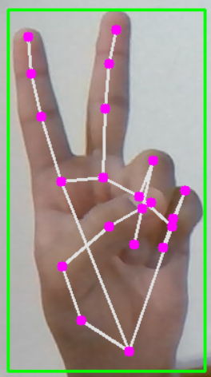
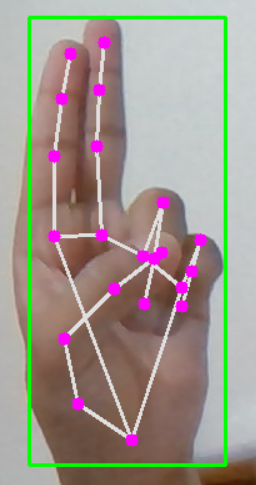

# Virtual Drag and Drop
Iron Man inspired Virtual Drag and Drop boxes using hand gestures.

#### Requirements-
1. Python 3.9
2. cvzone
3. mediapipe

#### How to run the script -
1. Use the command - `python .\main.py`

#### What does it do - 
1. Default camera window opens and 5 purple boxes are aligned on top of the screen.
2. Assuming your hand as a mouse - 

| Image represents mouse. | Image represents mouse click (can also hold and drag items). |
| :---: | :---: |
|  |  |
